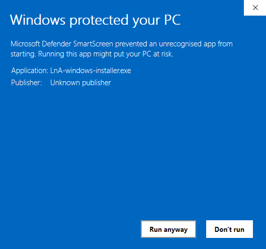
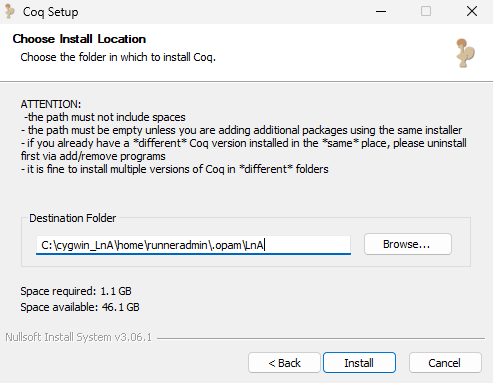

# Roqc-LnA README

This repository is created for the Radboud University Computing Science course 'Logic and Applications'. The goal of it is to create a Rocq environment where the tactics match as closely as possible to logical rules taught in this course.

Rocq-LnA provides 2 features to achieve this, a Rocq library and a Visual Studio Code (VS Code) extension.

### LnA package

The custom Rocq package is simply called LnA. It provides a set of tactics which are made to match as closely as possible to the logical rules as taught in the course. During the course, tasks will allow or disallow only a specific subset of this set.

### LnA-vscode-extension

The custom VS Code extension is build to provide immediate feedback on which tactics are used when they are not supposed to be. It uses special comment blocks, like `(*! benbta_proof *)`, to distinguish which set of tactics should be allowed.

It is an offline extension with no reference to an original document, so be careful not to change these comment blocks or the premise of a `Lemma` or `Theorem`. Doing this will not cause the extension to create a warning or error in VS Code, but it will be caught by ProofWeb when handing it in. You can always check in ProofWeb if the final result is valid by clicking `File > Load` and looking for the icon in front of the task. An orange flag in front of the task means tactics were used that are not allowed. You can inspect which tactics and where by clicking on the question mark button after the task.

# Installation guide

This guide is written to use [Visual Studio Code] (VS Code) as an editor. If you prefer not to send any telemetry, [VSCodium] should work, just replace all instances of `code` in this guide with `codium`.

1. First make sure you have a working installation of [Visual Studio Code].
2. Check if the editor is added to the PATH environment variable by opening a shell (eg. using Terminal, Powershell, etc) of your choice and running `code -v`. This should look similar to the following, the version may differ:

   

   - If you have a working installation of VS Code, but `code -v` does not work, you might have to add the installation directory to your PATH environment variable.

3. Next we will install `vscoq-language-server` and our `LnA` package:

   - Windows users can do this by downloading the file called ` LnA-windows-installer.exe` from our [latest release] page.
     DO NOT CHANGE THE INSTALLATION LOCATION. For more information on using this installer, got to the [dedicated section](#using-the-installer-for-windows-users) for using the installer on this page.

   - Linux and Apple users can manually install the prerequisite packages through `opam`.

     1. Apple users only: install `gpatch` using `brew install gpatch`
     2. Install and initialize [`opam`] from the package manager of your choice, for example for Apple users:

        ```shell
        brew update
        brew install opam
        opam init
        eval $(opam env --switch=default)
        ```

        or

        ```shell
        apt-get update
        apt-get install opam
        opam init
        eval $(opam env --switch=default)
        ```

        etc.

     3. Download and install our custom LnA library and its dependencies through opam by running:
        ```shell
        opam pin add -y https://github.com/logic-and-applications/rocq-lna/releases/download/v0.0.1/LnA-0.0.1.tar.gz
        ```
        the `-y` flag answers `yes` to the question if the versions to install are correct (and all other questions that may arise)

4. Install the [`vscoq`] extension.

   - Optionally, this can be done through a shell by running

     ```shell
     code --install-extension maximedenes.vscoq
     ```

   - Opening VS Code with this extension active for the first time will probably throw up the following error message, ignore it.
     
     Click it away by pressing `Cancel` and proceed to the next step, where we will solve it.

5. To make `vscoq` able to function, we will add the path to the installed location of `vscoqtop` to the User Settings of the extension:

   1. Find the path to `vscoqtop`. For Windows users using the installer this will be

      ```
      "C:\\cygwin_LnA\\home\\runneradmin\\.opam\\LnA\\bin\\vscoqtop"
      ```

      Otherwise, you can find it by running

      ```shell
      which vscoqtop
      ```

      on unix machines with opam added to the PATH environment correctly.

   2. Add this path to the `path` setting of `vscoq` (press ctrl+shift+P in VS Code and type "User Settings (JSON)", then hit Enter). Saving this file will save the setting.
      ```json
      {
         "vscoq.path": "C:\\cygwin_LnA\\home\\runneradmin\\.opam\\LnA\\bin\\vscoqtop"
         ...there may be other options
      }
      ```
   3. Close and re-open VS Code. The extension should now work for any `.v` file.

6. Download and install our custom VS Code extension: `LnA-VS-code`.

   1. Go to the [latest release]
   2. Download the `LnA-vscode-extension-0.0.1.vsix` file
   3. Navigate to the location of the downloaded file in a shell (for example by navigating to it in explorer and right clicking in the folder on the `Open in Terminal` option) and run

      ```shell
      code --install-extension LnA-vscode-extension-0.0.1.vsix
      ```

If everything worked, you should now be able to download or open [this test file](https://github.com/logic-and-applications/rocq-lna/blob/main/extension/src/test/coq-files/benbta_yes_tauto.v) and step through the file using `Alt+DownArrow`, or to the cursor using `Alt+RightArrow`. A second window should open to the right, and it should look similar to the following image:


### Using the Installer for Windows Users

Windows users can download our custom installer from our [latest release] page. DO NOT CHANGE THE INSTALLATION DIRECTORY!

1. We have not signed the installer, so windows will give a warning that the application about to be installed is not recognized:

   

   Ignore this warning by clicking `More info` and `Run anyway`

   

2. Allow the installer to make changes on your device by clicking `Yes` to enter the installation wizard. Then click past the start and agree to Rocq's user license agreement.
3. Next you may choose which components to install. Of these, only `coqide` is not required for the course. If you do not want `coqide`, uncheck it and click `Next`.

   `coqide` is a dedicated ide created for Rocq. You may choose to use this during the course, but it does not provide some of the custom the functionality of our VS Code extension or ProofWeb. To be sure your exercise is allowed for this course, you can copy the file to ProofWeb and check there.
   

4. DO NOT CHANGE THE INSTALLATION DIRECTORY! Changing the installation directory can have various strange side effects and will likely not work. Simply click `Install` at this step.
   
5. Continue with step 4 from the [Installation Guide](#installation-guide).

<!-- Links -->

## Installing custom packages

You may find that you want to explore Rocq's capabilities beyond the scope of this course. If you do, here are some instructions of how to install additional packages that are not used in this course. If you do, here is some help on how to do that if you installed Rocq using our instructions:

### Installing custom packages after having used the Windows installer

### Installing custom packages with `opam`

If you used `opam` to install the LnA package, you can similarly install other packages the same way, or by using `opam install`. Suppose you want to install the [`coq-iris`] package. If you do this for the first time, you will need to add the Coq opam repository first:

```shell
opam repo add coq-released https://coq.inria.fr/opam/released
```

This will make a [large collection](https://github.com/coq/opam/tree/master/released/packages) of coq packages available to install. Next you can install the package by running

```shell
opam install coq-iris
```

[Visual Studio Code]: https://code.visualstudio.com/download
[VSCodium]: https://github.com/VSCodium/vscodium/releases
[`vscoq`]: https://marketplace.visualstudio.com/items?itemName=maximedenes.vscoq
[latest release]: https://github.com/logic-and-applications/rocq-lna/releases/latest
[`opam`]: https://opam.ocaml.org/doc/Install.html
[`coq-iris`]: https://gitlab.mpi-sws.org/iris/iris
